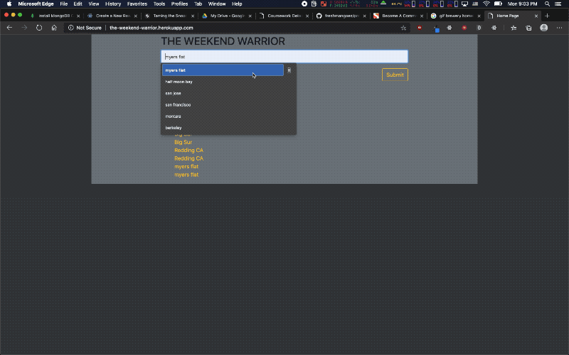

# Weekend Warrior
A tool meant for hikers and campers to look up the local weather and conditions of a campsite or hiking trail.

Made with NodeJS, Express, Handlebars, MySQL/Sequelize, HikingProject API, OpenWeather API, and jQuery.

- Node JS for the framework
- Express for the server backend and API calls
- Handlebars and jQuery for rendering the front end dynamically
- Sequelize for storing the search history

# Instructions
Clone the repo. Run `npm i` in the root directory. Then run `node server.js`. Then open http://localhost:3000 in your web browser!

